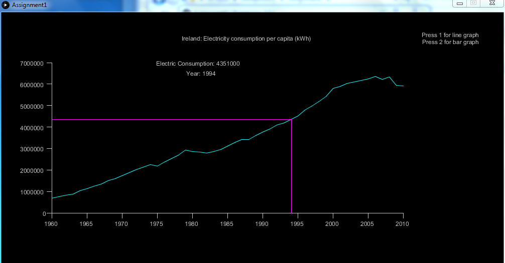
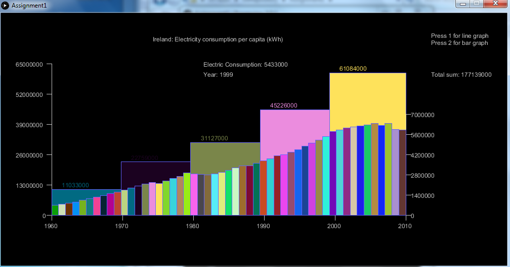

# Assignment1

Description: 
Find a Data set and load the dataset into a Processing sketch.
Create two(2) visualisation with a menu which allows user to choose between the visualisations.

My plan:
Making visualisation about Ireland: Electricity consumption per capita (kWh) data set.
Create a line graph with extra features.
Create a bar chart or another visualisation with extra features.

This is the line graph I made that when you hover the mouse from left to right two lines in colour purple will show where in the line graph is the year and the Electric consumption for that year.
It also show the year and electric consumption in text form in the middle top area.
By pressing 1 or 2 the graph will change from line graph to bar graph respectively.

This is the bar graph I made. The smaller bar graph show the individual record per year and the 5 big bar graph show the sum of the smaller bar graph that is inside of the big bar graph.

Resource:
[Data set](http://www.factfish.com/statistic-country/ireland/electricity%20consumption%20per%20capita)

